# Ansible Configuration Management - Automate Project 7 to 10

### Tasks
- Install and configure Ansible client to act as a Jump Server/Bastion Host
- Create a simple Ansible playbook to automate servers configuration

### Step 1 - Install and Configure Ansible on EC2 Instance

1. Update the Name tag on your Jenkins EC2 Instance to Jenkins-Ansible. We will use this server to run playbooks.
2. In your GitHub account create a new repository and name it ansible-config-mgt.
3. Install Ansible (see:[install Ansible with pip](https://docs.ansible.com/ansible/latest/installation_guide/intro_installation.html#installing-ansible-with-pip))


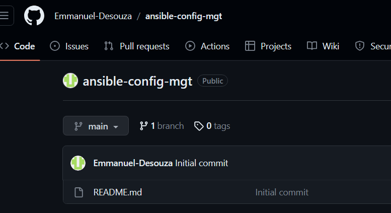

```
sudo apt update
sudo apt install ansible
```

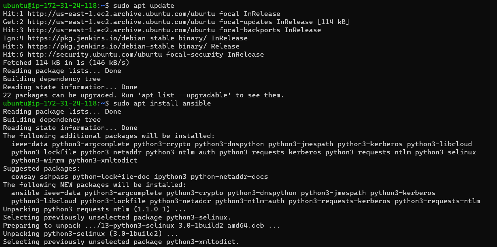

### Check your Ansible version by running `ansible --version`

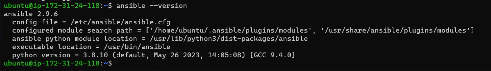

4. Configure Jenkins build job to archive your repository content every time you change it - this will solidify your Jenkins configuration skills acquired in Project 9.

- Create a new Freestyle project ansible in Jenkins and point it to your 'ansible-config-mgt' repository.

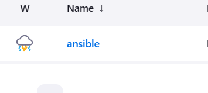

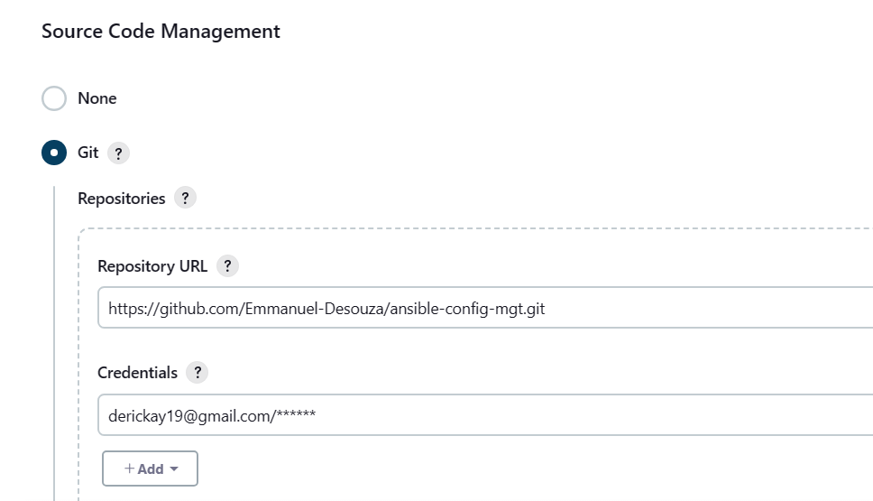

- Configure a webhook in GitHub and set the webhook to trigger ansible build.

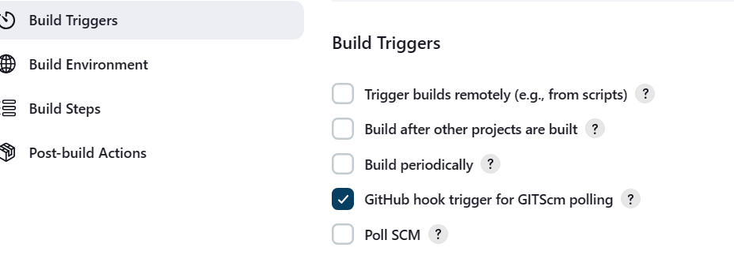

- Configure a Post-build job to save all (**) files, like you did it in Project 9.

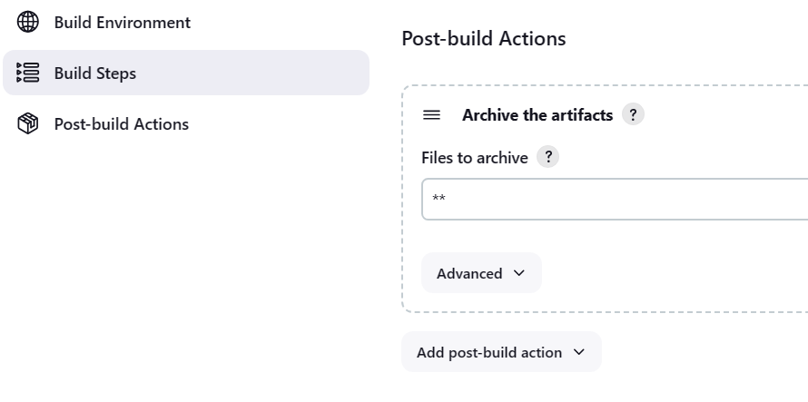

5. Test your setup by making some change in README.md file in master branch and make sure that builds starts automatically and Jenkins saves the files (build artifacts) in following folder /var/lib/jenkins/jobs/ansible/builds/<build_number>/archive/

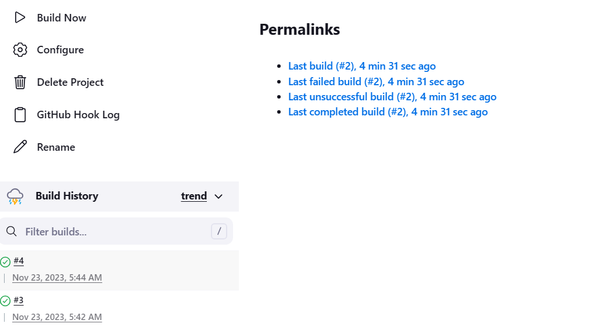

`ls /var/lib/jenkins/jobs/ansible/builds/<build_number>/archive/`

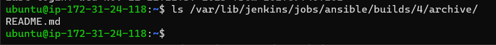

## Note: Trigger Jenkins project execution only for main (or master) branch.

## Now, the setup will look like this:

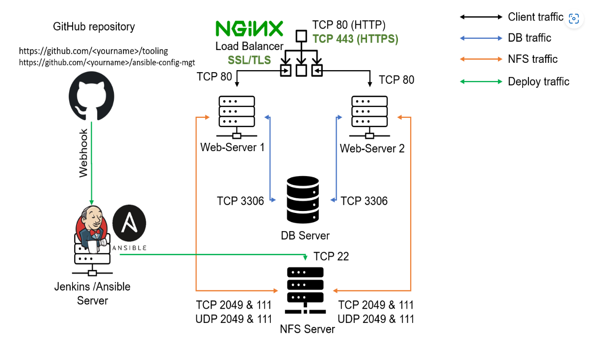

## Tip: Every time you stop/start your Jenkins-Ansible server - you have to reconfigure GitHub webhook to a new IP address, in order to avoid it, it makes sense to allocate an Elastic IP to your Jenkins-Ansible server (you have done it before to your LB server in Project 10). Note that Elastic IP is free only when it is being allocated to an EC2 Instance, so do not forget to release Elastic IP once you terminate your EC2 Instance.

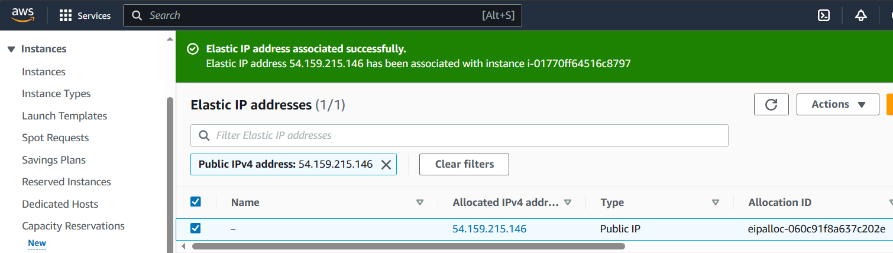

### Step 2 - Prepare your development environment using Visual Studio Code

1. First part of 'DevOps' is 'Dev', which means you will require to write some codes and you shall have proper tools that will make your coding and debugging comfortable - you need an Integrated development environment (IDE) or Source-code Editor. There is a plethora of different IDEs and source-code Editors for different languages with their own advantages and drawbacks, you can choose whichever you are comfortable with, but we recommend one free and universal editor that will fully satisfy your needs - Visual Studio Code (VSC), you can get it here.

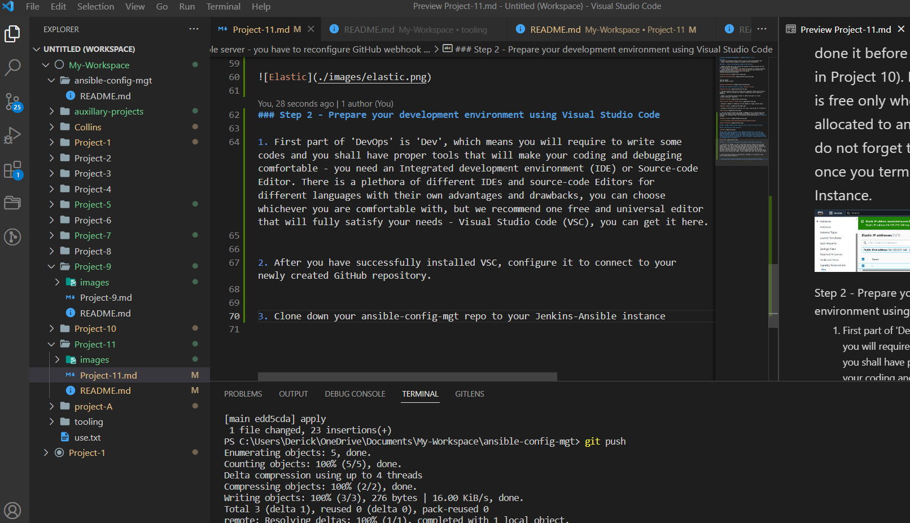

2. After you have successfully installed VSC, configure it to connect to your newly created GitHub repository.

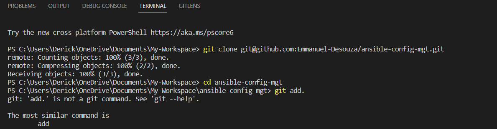
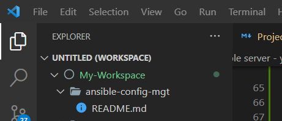

3. Clone down your ansible-config-mgt repo to your Jenkins-Ansible instance

`git clone <ansible-config-mgt repo link>`

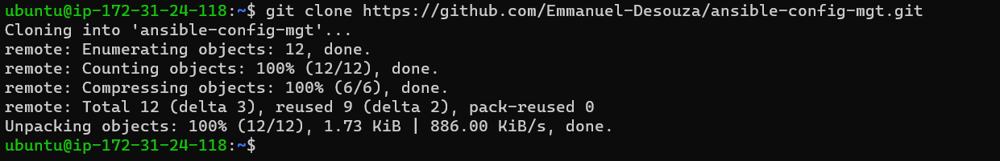

## Step 3 - Begin Ansible Development

